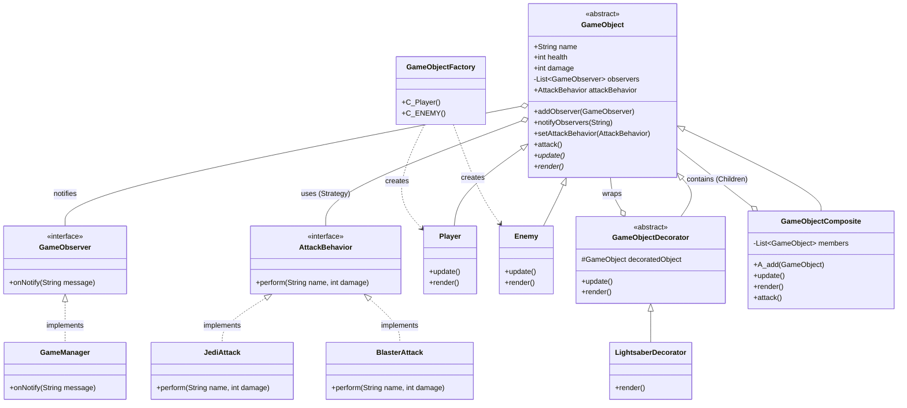

# Tasarim-Oruntuleri-Project
Konya Teknik Üniversitesi 2025-2026 akademik yılı güz dönemi Yazılım Tasarım Örüntüleri dersi ödevi.
Konu Seçimi: C - Mini Oyun Motoru
Gerekçesi: Oyun geliştirme dünyasına ve oyun oynamaya olan ilgim konuyu seçmemde büyük rol oynadı. Bu proje ile oyun geliştirmeye olan ilgimi artıracak ve öğrenerek kendimi geliştireceğim.

Proje Hakkında
Bu çalışma, yazılım sistemlerindeki esneklik ve sürdürülebilirlik sorunlarını tasarım örüntüleri ile çözmeyi hedefliyor. Proje kapsamında, başlangıçta karmaşık ve "if-else" bloklarına dayalı olan yapı, Faz 3 itibarıyla tamamen düzenli ve SOLID prensiplerine uygun bir hale dönüştürülmüştür.

Kullanılan Tasarım Örüntüleri
Factory Method:	Nesne yaratma mantığını kapsülleyerek, sistemin hangi sınıftan nesne üreteceğini çalışma zamanında belirlemesini sağlar.
Decorator: Nesnelere, mevcut sınıfları bozmadan dinamik olarak yeni özellikler ekler.
Composite: Nesneleri ağaç yapısında düzenleyerek, tekil ve grup nesnelerin aynı arayüz üzerinden yönetilmesini sağlar.
Strategy: Bir algoritma ailesini tanımlar ve bunları birbirinin yerine kullanılabilir hale getirerek OCP'yi sağlar.
Observer: Nesneler arasında bire-çok bağımlılık kurarak, bir nesnedeki durum değişiminden diğer tüm ilgililerin haberdar olmasını sağlar.

Mimari Diyagram

Nasıl Çalıştırılır?

Gereksinimler:
-Java JDK 17 veya üzeri
-Git

Adımlar:
Projeyi klonlayın:
git clone [REPOLINK]

src klasörüne gidin ve derleyin:
javac -d out src/*.java

Uygulamayı çalıştırın:
java -cp out Main