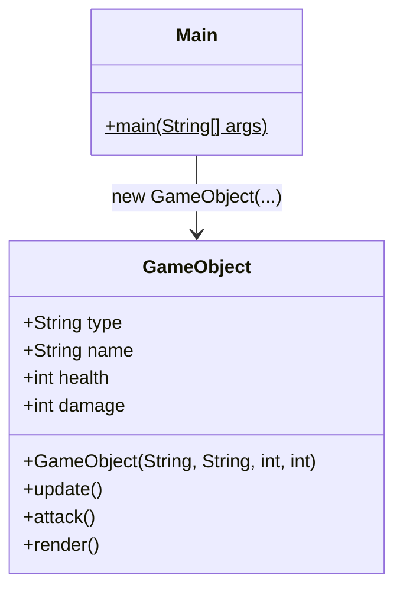
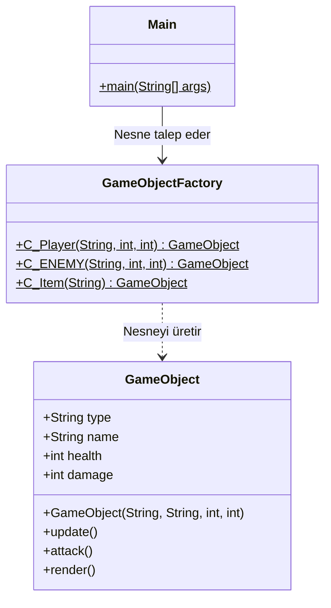

## 1. Önce (Başlangıç Durumu)

```mermaid
classDiagram
    class Main {
        +main(String[] args)$
    }
    class GameObject {
        +String type
        +String name
        +int health
        +int damage
        +GameObject(String, String, int, int)
        +update()
        +attack()
        +render()
    }
    Main --> GameObject : new GameObject(...)
```
## 2. Sonra (Factory Method Uygulaması)

```mermaid
classDiagram
    class Main {
        +main(String[] args)$
    }
    class GameObjectFactory {
        +C_Player(String, int, int)$ GameObject
        +C_ENEMY(String, int, int)$ GameObject
        +C_Item(String)$ GameObject
    }
    class GameObject {
        +String type
        +String name
        +int health
        +int damage
        +GameObject(String, String, int, int)
        +update()
        +attack()
        +render()
    }
    Main --> GameObjectFactory : Nesne talep eder
    GameObjectFactory ..> GameObject : Nesneyi üretir
```